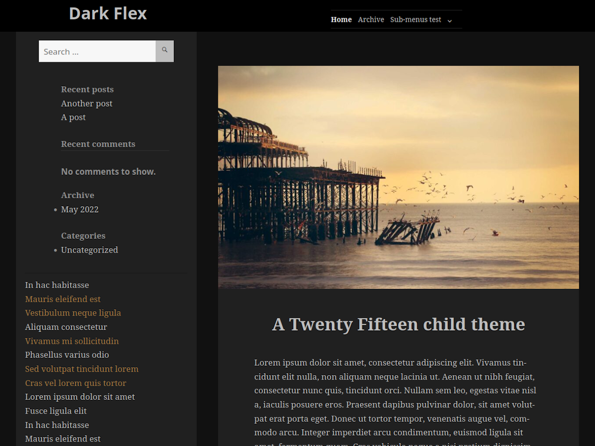

# Dark Flex

The theme that I use for my main website.

<p align="center">
  
</p>

I like the theme _Twenty Fifteen_ in its dark colors; however, I wanted to add a top menu. Then, I couldn't stop myself from customizing, so in the end I created a child theme with various features.

## Installation

Install the original theme _Twenty Fifteen_.

Download this repository.

Rename the main folder to _"twentyfifteen-child"_ and upload it to _wp-content/themes/_

## Modifications

* The menu is moved into the header, which is made sticky. Internal links are supported with `scroll-padding-top`.
* In mobile, the sidebar is moved to the bottom and is always visible.
* The top menu sub-menus are displayed like in the theme _"Twenty Sixteen"_ (with popups).
* A "back to top" button is added for desktop.
* Removed: site description, background header image, site footer, author info.
* The sidebar sticky behavior is improved with a JS plugin. Added div `main-container` for it to work.
* Removed the _"social"_ menu and added a _"sidebar"_ menu
* Meta-info header for posts, in addition to the footer, for easier navigation.
* All three types of post excerpts are shown (more, manual, automatically trimmed), and a different style is used for each, with less spacing for a better list view.
* No footer link for _"asides"_; if used together with e.g. _Ultimate Category Excluder_, you can make uncategorized aside posts unsearchable.
* External link class, to make it clear when a link points externally.
* Added classes for quote sources, including quotes from the internet.
  See [Quote styles demonstration](https://andreacalligaris.netsons.org/dev/quote-styles-demonstration)
* Customized audio template (with featured image) and image template.
* Display "Next" / "Previous" links in the post footer only within the same category, while still showing the parent categories in the meta infobox.

## HTML structure

```
body
	#page .hfeed .site
		#header-spacer .header-spacer
		header #masthead .site-header (with the top menu "primary")

		#main-container .clearfix
			#sidebar .sidebar (moved below in mobile via CSS)
				.sidebar__inner (class for the sticky sidebar plugin)
					#secondary .secondary
						(search-area, widget-area, sidebar menu)
			#content .site-content
				#primary .content-area
					#main .site-main

		.back-to-top (button)
		[optional footer can go here]
```

## CSS notes

* In the parent theme, `secondary-toggle` is the button that, in mobile, toggles what is the sidebar on desktop. In this theme, for clarity, this class is ignored and a new class named `button-top-menu-toggle` is used, because now, in mobile, only the main menu needs to be toggled, and the sidebar is moved to the bottom of the page and is always visible.
* Fixed inconsistency from the parent theme, where sometimes `toggled-on` is used, and other times `toggle-on` is used.
* `.secondary.toggled-on` is also ignored, because now it's `.main-navigation` (the sticky top menu on desktop) that is going to be set on/off on mobile.

## Known issues

* When you're logged in WP, the sidebar may glitch a bit because of the admin bar (by just manually scrolling a bit it should stop the behavior); fixing this may be complicated, but at least it works for normal users.

## Screenshots

<p align="center">
  <a href="https://andreacalligaris.netsons.org/media/dev/dark-flex-screenshot_1.jpg"></a>
  &nbsp;&nbsp;&nbsp;&nbsp;
  <a href="https://andreacalligaris.netsons.org/media/dev/dark-flex-screenshot_2.jpg"></a>
</p>

